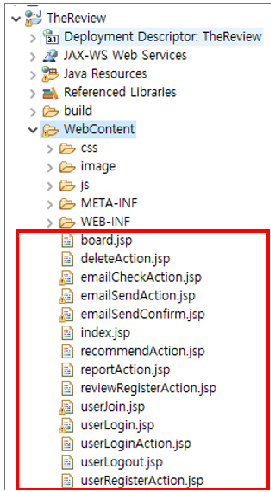
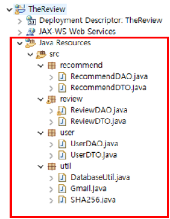
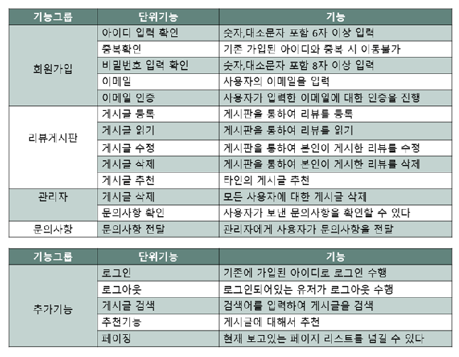
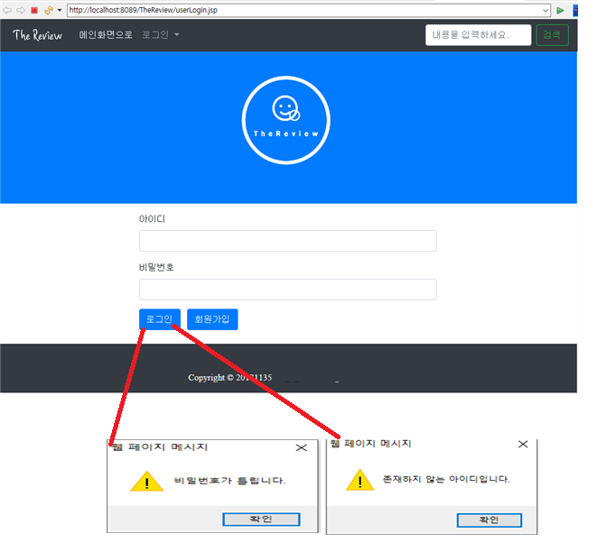

## JSP기반 리뷰 웹사이트 - 1인 Toy 프로젝트

JSP, JQuery, HTML을 기반으로 작성한 프로젝트입니다.
자유롭게 여러 카테고리의 상품에 대한 리뷰와 평가를 남기는 CRUD 기능을 구현한 게시판 웹사이트입니다. 
대학교 재학시절 JSP 모델 1 구조를 학습하기 위한 용도로 구현하였습니다.

## 1. 개발환경
<blockquote> 

 언어

</blockquote>
<ul>
<li>JSP (java 8)</li>
</ul>
<blockquote> 

 프레임워크 & 라이브러리

</blockquote>
<ul>
<li>Bootstrap 3</li>
<li>JQuery3</li>
<li>Mysql 5.7</li>
<li>Mail.jar </li>
</ul>
<blockquote> 

 IDE

</blockquote>
<ul>
<li>Eclipse</li>
</ul>

## 2. 패키지 구조 & DB 구조

## 3.  프로젝트 구조  & 기능목록
### 구조 - Model 1

### 웹사이트 흐름도

### 기능목록

## 4.  구현기능 화면

### 1. 메인화면 & 관리자 문의기능

문의할 제목과 내용을 입력하고 전송을 클릭하면 해당 문의가 관리자의 이메일로 전송됩니다.

없는 유저를 기입하거나, 비밀번호가 틀렸을 시 경고메시지를 출력하며
로그인 성공 시, Review 게시판으로 Redirect 합니다.

### 2. 회원가입 & 메일인증

회원가입 페이지에서 회원가입이 진행됩니다. 중복된 아이디는 에러메시지가 출력됩니다. 
회원가입 기능을 완료하기 위해서 중복회원 방지를 위한 이메일 인증이 진행됩니다.

### 3. 리뷰게시판

리뷰 게시판에서 

1. 글쓰기 버튼을 클릭 시 리뷰를 등록할 수 있습니다.
2. 삭제를 클릭 시 게시물을 삭제할 수 있습니다.
3. 추천을 클릭 시 게시물을 추천할 수 있습니다.

## 5. 한계점 & 추후개발 과제
- 이미지 업로드 기능 수정
게시판의 이미지 업로드 기능에 오류가 발생하여, 제출한 파일에 이미지 업로드 기능이 제대로 동작하지 않는다. 이 부분이 제대로 동작하기 위해서 추가 기능구현 필요합니다.
- 페이징 기능 보안
현재 페이징기능은 다섯 개의 게시물을 기준으로 이전, 다음 버튼을 이용하여 페이징 처리를 한다. 훨씬 이전에 쓴 글도 손쉽게 확인하기 위해서페이징 기능의 개선을 할 계획에 있다.
- 디자인 개선

## 6. 참고자료

개발서적과 인터넷에 공개된 여러 코드를 참고하였습니다.

-  [JSP Programming (답변형 게시판과 회원가입을 단계적으로 개발하며 배우는)](https://book.naver.com/bookdb/book_detail.naver?bid=8161645)
- <a href="https://ndb796.tistory.com/43">ndb796 tistory<a/>
- Kwak Min-sung GitHub Repository
